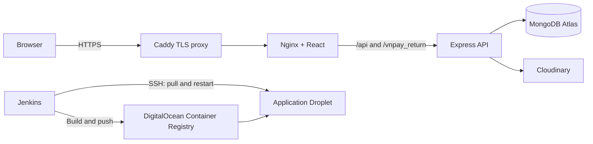

# Deploy with Docker, Jenkins, and DigitalOcean

## Architecture



The frontend and API share one public domain. Nginx forwards `/api` to Express, so browser requests and Google OAuth return to the same origin. Caddy obtains and renews HTTPS certificates. MongoDB is external; do not point a container at `localhost` for the database.

## 1. Create DigitalOcean resources

1. Create a DigitalOcean Container Registry and note its namespace, for example `hotel-prod`. The full image names will be `registry.digitalocean.com/hotel-prod/hotel-booking-api` and `.../hotel-booking-frontend`.
2. Create an Ubuntu 24.04 Droplet for the application. A 2 GB RAM Droplet is a reasonable starting point for this small two-container app; leave room for Caddy and Docker image updates. Create a separate Droplet for Jenkins/builds so CI load and credentials are isolated from the public app.
3. Point an `A` record for the application domain (for example `booking.example.com`) to the application Droplet's public IPv4 address. Wait for DNS to resolve before starting Caddy.
4. Configure the DigitalOcean Cloud Firewall to allow inbound TCP 22 only from trusted admin/Jenkins IPs, and TCP 80 and 443 from the internet. Do not expose API port 5000.
5. Create a MongoDB Atlas database. Add the application Droplet's public IP to the Atlas Network Access allowlist, create a database user, and copy the connection URI. URL-encode special characters in its password.

Install Docker Engine and the Docker Compose plugin on both Droplets using Docker's official Ubuntu instructions. On the application Droplet, add the SSH deployment user to the `docker` group and create the application directory:

```sh
sudo usermod -aG docker <deploy-user>
sudo mkdir -p /opt/hotel-booking
sudo chown <deploy-user>:<deploy-user> /opt/hotel-booking
```

Log out and back in after changing group membership. Membership in the `docker` group is effectively root access; use a dedicated deployment account and SSH key.

## 2. Configure app secrets

On the application Droplet, create `/opt/hotel-booking/backend.env` from [`backend/.env.example`](backend/.env.example), then restrict access:

```sh
cd /opt/hotel-booking
nano backend.env
chmod 600 backend.env
```

Set real values for `MONGO_URL`, `JWT_SECRET`, `REFRESH_TOKEN_SECRET`, `SESSION_SECRET`, and the integrations the app uses. Generate three different long random secrets. Do not commit `backend.env` or copy it into a Docker image.

Set the public URLs consistently:

- `CLIENT_URL=https://booking.example.com`
- `CORS_ORIGINS=https://booking.example.com`
- `GOOGLE_CALLBACK_URL=https://booking.example.com/api/auth/google/callback`
- `VNP_RETURN_URL=https://booking.example.com/api/payments/vnpay_return`

Add the Google callback URL to the OAuth client's authorized redirect URIs. Set the production VNPay endpoint and credentials before accepting real payments; the sample uses the VNPay sandbox URL. Set the Cloudinary values if room image uploads are required. For email, this backend reads `SMTP_HOST`, `SMTP_PORT`, `SMTP_USER`, `SMTP_PASS`, and `FROM_EMAIL` (not the older `EMAIL_*` names that may be present in a local env file).

## 3. Configure Jenkins

Install Jenkins LTS on the separate Jenkins Droplet and install the Docker CLI/Engine on its build agent. The agent needs `docker build` support. Giving Jenkins access to the Docker socket grants root-equivalent access, so run trusted pipelines only and isolate build agents where possible.

In Jenkins:

1. Install GitHub Branch Source and Credentials Binding plugins.
2. Add a username/password credential with ID `do-cr-credentials` for DigitalOcean Container Registry push/pull access. Verify that the credential can run `docker login registry.digitalocean.com` on the build agent.
3. Add the private deployment SSH key as an “SSH Username with private key” credential with ID `do-droplet-ssh`. Install its public key for the dedicated deployment user on the app Droplet.
4. Pre-populate and verify the app Droplet host key in `known_hosts` on every Jenkins build/deploy agent. The pipeline intentionally uses normal strict SSH host-key checking.
5. In [`Jenkinsfile`](Jenkinsfile), replace `YOUR_REGISTRY`, `YOUR_DROPLET_IP`, and `booking.example.com` with the registry namespace, Droplet IP, and domain. Keep credentials out of this file.
6. Create a Multibranch Pipeline pointing at this GitHub repository, using the `main` branch. Configure a GitHub webhook (or GitHub Branch Source webhook management) so pushes trigger the pipeline.

The pipeline checks out the commit, builds both images, tags them with the Git commit SHA, pushes to DOCR, uploads the deployment Compose/Caddy files, writes only non-secret release metadata to `deploy.env`, and restarts the stack. The backend secret file remains on the Droplet and is not overwritten by CI.

## 4. Deploy and verify

Push the configured `Jenkinsfile` and Docker files to `main`, then watch the Jenkins build. On the app Droplet, verify the containers and logs:

```sh
cd /opt/hotel-booking
docker compose --env-file deploy.env -f compose.deploy.yaml ps
docker compose --env-file deploy.env -f compose.deploy.yaml logs --tail=100 api frontend caddy
curl -fsS https://booking.example.com/healthz
```

The `/healthz` endpoint returns HTTP 200 only after Mongoose connects to MongoDB. Visit the site over HTTPS, then test registration/login, Google OAuth, image upload, email, and VNPay sandbox return flow as applicable. Confirm Google OAuth and VNPay dashboards have the same HTTPS callback URLs.

For ongoing operations, keep the Droplet patched, restrict SSH, retain Caddy's `/data` volume, monitor disk usage, and take MongoDB backups. A failed health check usually means `MONGO_URL`/Atlas IP access is wrong; a 502 usually means the API container did not become healthy or its logs show a startup error.